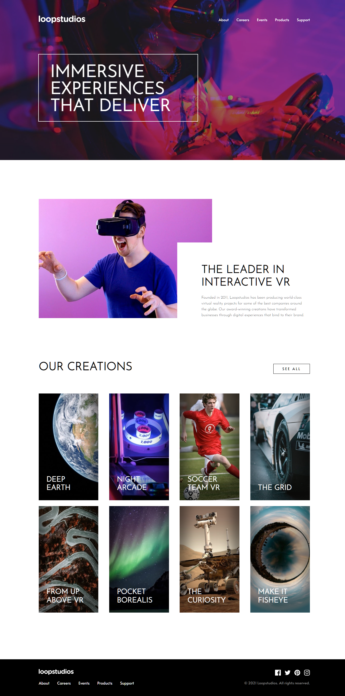

# Frontend Mentor - Loopstudios landing page solution

This is a solution to the [Loopstudios landing page challenge on Frontend Mentor](https://www.frontendmentor.io/challenges/loopstudios-landing-page-N88J5Onjw). Frontend Mentor challenges help you improve your coding skills by building realistic projects. 

## Table of contents

- [Overview](#overview)
  - [The challenge](#the-challenge)
  - [Screenshot](#screenshot)
  - [Links](#links)
- [My process](#my-process)
  - [Built with](#built-with)
  - [What I learned](#what-i-learned)
- [Author](#author)

## Overview

### The challenge

Users should be able to:

- View the optimal layout for the site depending on their device's screen size
- See hover states for all interactive elements on the page

### Screenshot



### Links

- HTML Solution URL: [HTML](https://github.com/JustANipple/loopstudios-landing-page/blob/master/index.html)
- CSS Solution URL: [CSS](https://github.com/JustANipple/loopstudios-landing-page/blob/master/styles/css/main.css)
- JS Solution URL: [JS](https://github.com/JustANipple/loopstudios-landing-page/blob/master/scripts/script.js)
- Live Site URL: [Live](https://justanipple.github.io/loopstudios-landing-page/)

## My process

### Built with

- Semantic HTML5 markup
- CSS custom properties
- Flexbox
- CSS Grid
- Mobile-first workflow
- SASS
- JavaScript
- Components

### What I learned

This time i wanted my nav bar in mobile view to show options one by one animated, so i used a setTimeout to achieve it and i think it looks better than animating the whole block together

navBar options animation:
```js
  for(let i = 0; i < listItems.length; i++) {
      setTimeout(function() {
          listItems[i].classList.add("slide");
      }, 100 * i);
  }
```

## Author

- Frontend Mentor - [@JustANipple](https://www.frontendmentor.io/profile/JustANipple)
